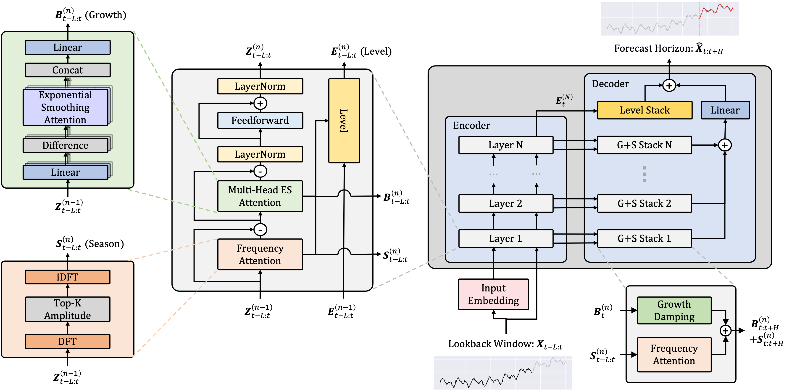

# ETSformer: Exponential Smoothing Transformers for Time-series Forecasting


Official PyTorch code repository for the [ETSformer paper](https://arxiv.org/abs/2202.01381).

## Requirements
Required dependencies can be installed by:
```bash
pip install -r requirements.txt
```

## Data
* Pre-processed datasets can be downloaded from the following links, [Tsinghua Cloud](https://cloud.tsinghua.edu.cn/d/e1ccfff39ad541908bae/) or [Google Drive](https://drive.google.com/drive/folders/1ZOYpTUa82_jCcxIdTmyr0LXQfvaM9vIy?usp=sharing), as obtained from [Autoformer's](https://github.com/thuml/Autoformer) GitHub repository. 
* Place the downloaded datasets into the `dataset/` folder, e.g. `dataset/ETT-small/ETTm2.csv`.

## Usage

1. Install Python 3.8, and the required dependencies.
2. Download data as above, and place them in the folder, `dataset/`.
3. Train the model. We provide the experiment scripts of all benchmarks under the folder `./scripts`, e.g. `./scripts/ETTm2.sh`. You might have to change permissions on the script files by running`chmod u+x scripts/*`.
4. The script for grid search is also provided, and can be run by `./grid_search.sh`.

## Acknowledgements
The implementation of ETSformer relies on resources from the following codebases and repositories, we thank the original authors for open-sourcing their work.
* https://github.com/thuml/Autoformer
* https://github.com/zhouhaoyi/Informer2020

## Citation
Please consider citing if you find this code useful to your research.
<pre>@article{woo2022etsformer,
    title={ETSformer: Exponential Smoothing Transformers for Time-series Forecasting},
    author={Gerald Woo and Chenghao Liu and Doyen Sahoo and Akshat Kumar and Steven C. H. Hoi},
    year={2022},
    url={https://arxiv.org/abs/2202.01381},
}</pre>